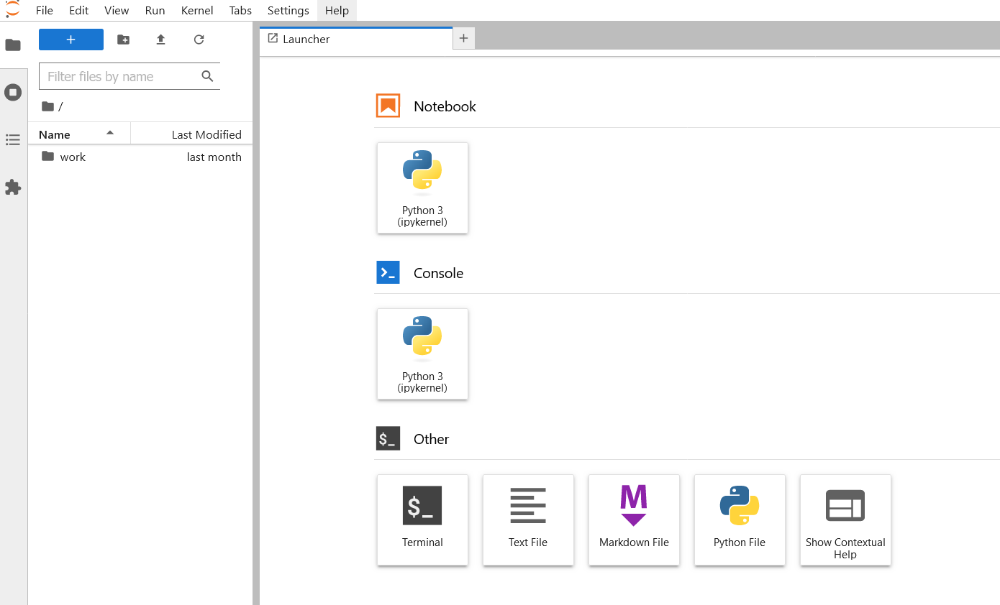

This is a docker jupyter server (that has been tested and is working)
Here are the steps to spin it up.
- run docker-compose -up
- check the logs for the container to get the token and url
- paste the url into a browser... it should look something like this: http://127.0.0.1:8888/lab?token=9b859cd55837b7d2d19e4e54f6735532ac3e412ee97ab328

You should then be presented with a screen like this:

If you have any questions, comments, or suggestion. Please let me know!
